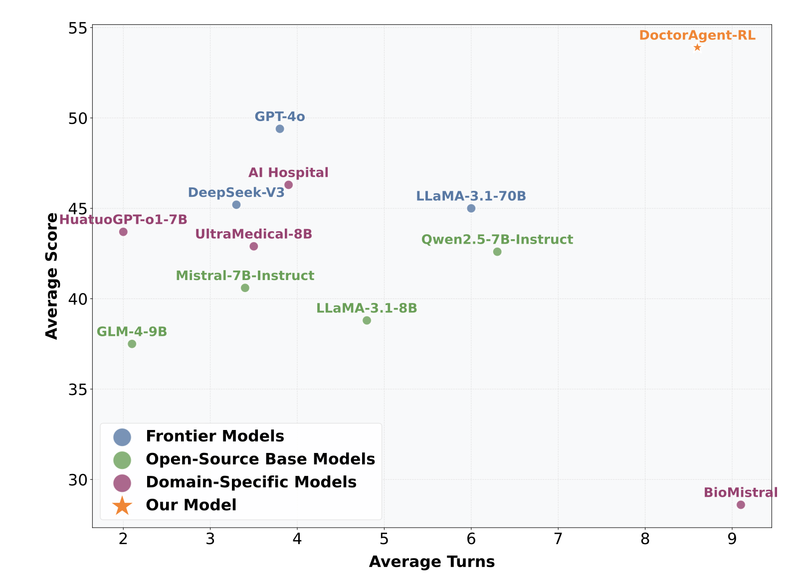
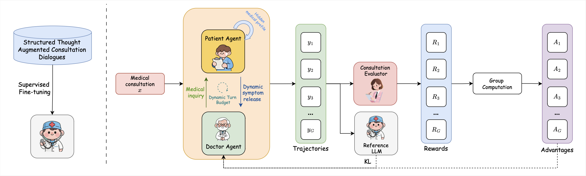
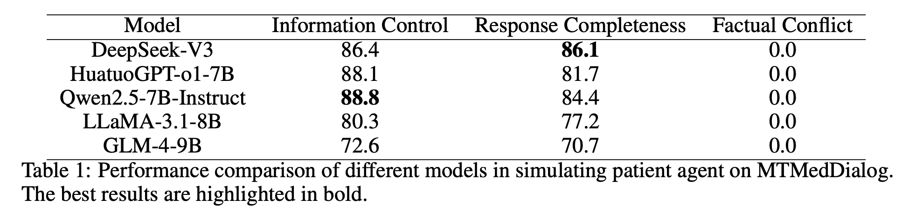
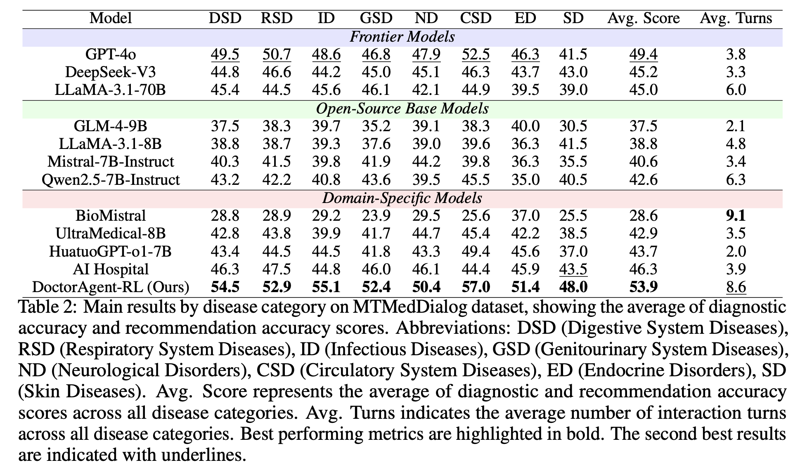
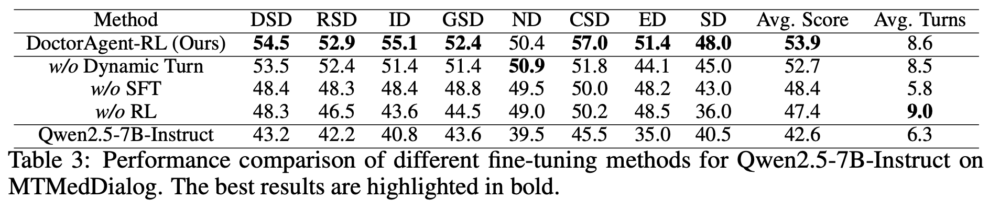
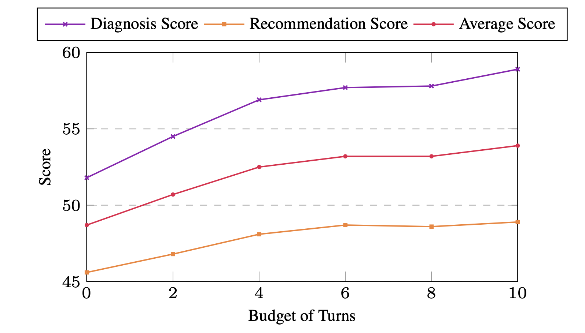

# DoctorAgent-RL 🚀: Multi-Agent Collaborative Reinforcement Learning for Clinical Dialogue

[](https://en.wikipedia.org/wiki/Research) [](DATASET.md)

<div align="center">
  
</div>

---

## Table of Contents
- [Introduction](#introduction)
- [Key Features](#key-features)
- [Methodology](#methodology)
- [Experiments](#experiments)
- [Citation](#citation)

---

- Code will be released soon.

## Introduction

DoctorAgent-RL is a reinforcement learning-based multi-agent collaborative framework designed to address the critical limitations of current clinical dialogue systems. By modeling medical consultations as dynamic decision-making processes under uncertainty, our framework enables:

1. **Adaptive Information Gathering**: Intelligent adjustment of dialogue paths based on patient responses
2. **Clinical Reasoning Alignment**: Autonomous development of interaction strategies consistent with medical logic
3. **Overcoming Static Paradigms**: Moving beyond superficial pattern imitation in existing dialogue datasets

Through continuous multi-turn interactions between doctor and patient agents optimized via reinforcement learning, DoctorAgent-RL achieves significant improvements in diagnostic accuracy and interaction efficiency.

---

## Key Features

- 🧠 **Multi-Agent Collaboration**: Doctor and patient agents with distinct roles and objectives
- 📈 **Dynamic Strategy Optimization**: Reinforcement learning-based policy updates
- 🎯 **Comprehensive Reward Design**: Multi-dimensional consultation evaluation metrics
- 📊 **Medical Knowledge Integration**: Clinical reasoning logic embedded in decision-making
- 📄 **MTMedDialog Dataset**: First English multi-turn medical consultation dataset with simulation capabilities

---

## Methodology

<div align="center">
  
</div>

Our framework consists of three core components:

1. **Doctor Agent**: Responsible for diagnostic reasoning and question formulation
2. **Patient Agent**: Simulates patient responses based on medical history and symptom progression
3. **Consultation Evaluator**: Provides comprehensive feedback through multi-dimensional reward signals

The reinforcement learning process involves:
1. Multi-turn dialogue simulation between agents
2. Dynamic reward calculation based on consultation quality
3. Policy updates using proximal policy optimization
4. Continuous strategy refinement through iterative interactions

---

## Experiments

### Patient Agent Evaluation

We Choose Qwen2.5-7B-Instruct as the Patient Agent in our experiments.

<div align="center">
  
</div>

### Doctor Agent Evaluation

<div align="center">
  
</div>

### Ablation Study

<div align="center">
  
</div>

<div align="center">
  
</div>

## Citation

If you find DoctorAgent-RL useful for your research, please cite our upcoming paper:

```latex
@article{DoctorAgent-RL,
  title={DoctorAgent-RL: Multi-Agent Collaborative Reinforcement Learning for Clinical Dialogue},
  author={Yichun Feng, Jiawei Wang, Lu Zhou, Yixue Li},
  journal={Arxiv Preprint},
  year={2025},
}
```